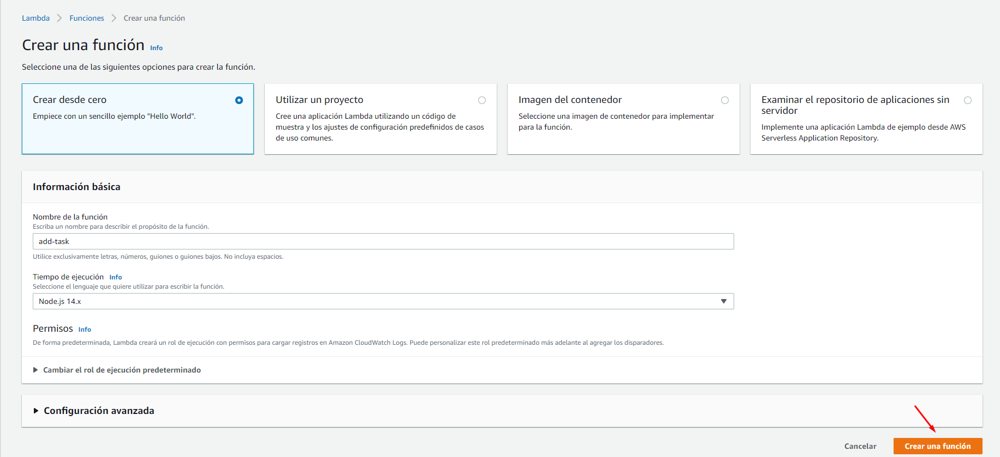
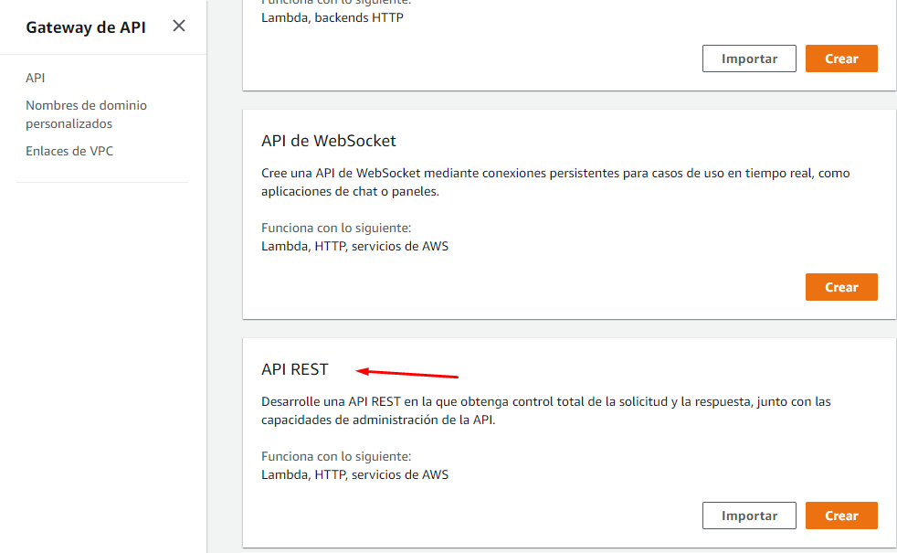
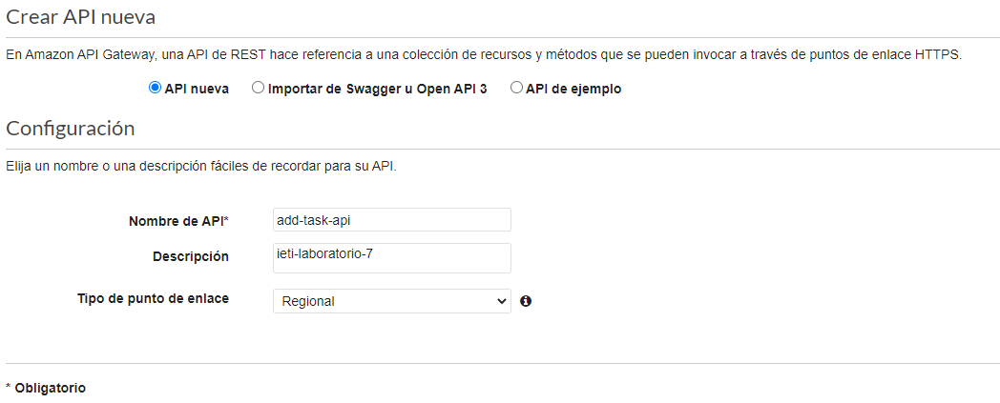
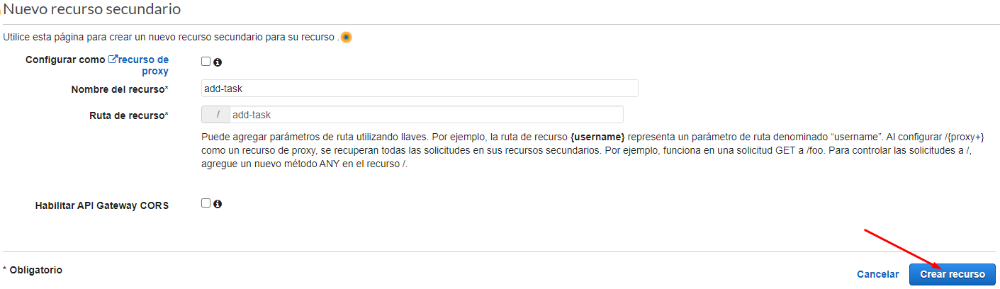
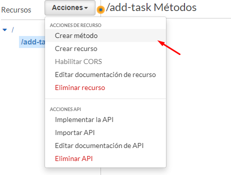
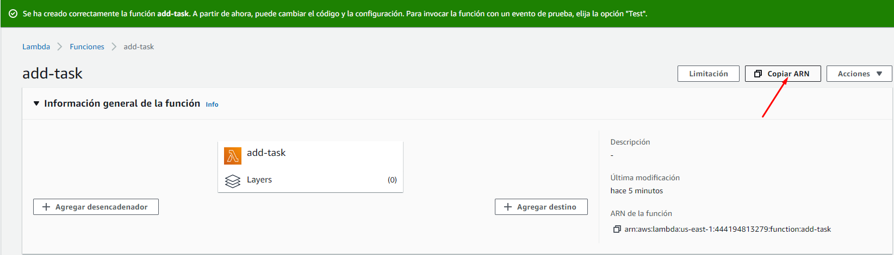
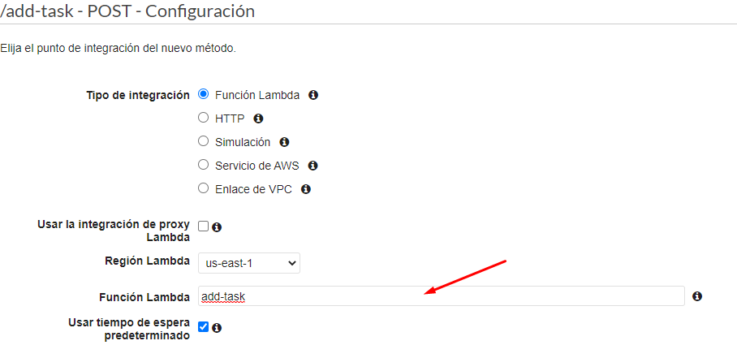
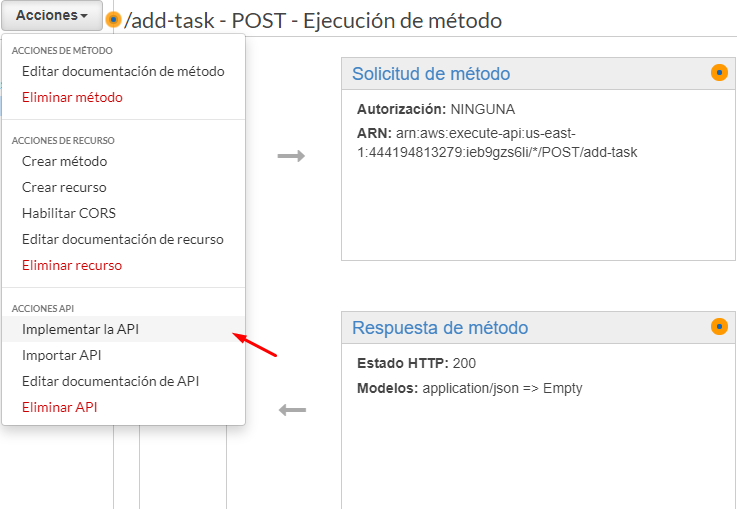
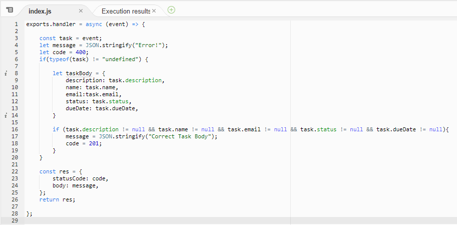
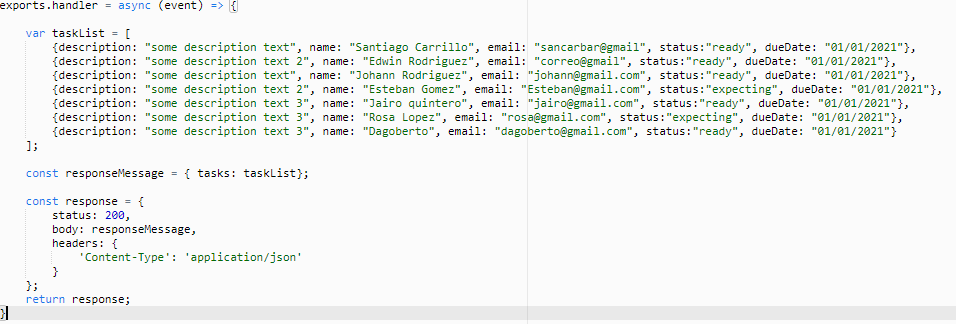

# IETI-Laboratorio-7

## Part 1: Add Task API

Usamos aws Lambda y api gateway para implementar nuestra api

link post:

https://ieb9gzs6li.execute-api.us-east-1.amazonaws.com/v1/add-task

ejemplo body:

```
{
  "description": "prueba aws",
  "name": "Edwin",
  "email": "edwin@gmail.com",
  "status": "estado",
  "dueDate": "01/01/2021"
}
```

link get:

https://ieb9gzs6li.execute-api.us-east-1.amazonaws.com/v1/add-task

### pasos de la implementación:

creamos una funcion



Usamos api gateway para poder usar la función





creamos un metodo post para la primera funcion





implementamos la api para que nos de el link



modificamos la función index.js



## Part 2: List Tasks API

creamos otra funcion y le creamos un metodo get en el api gateway

